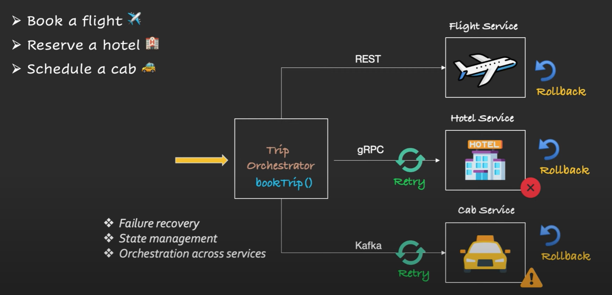
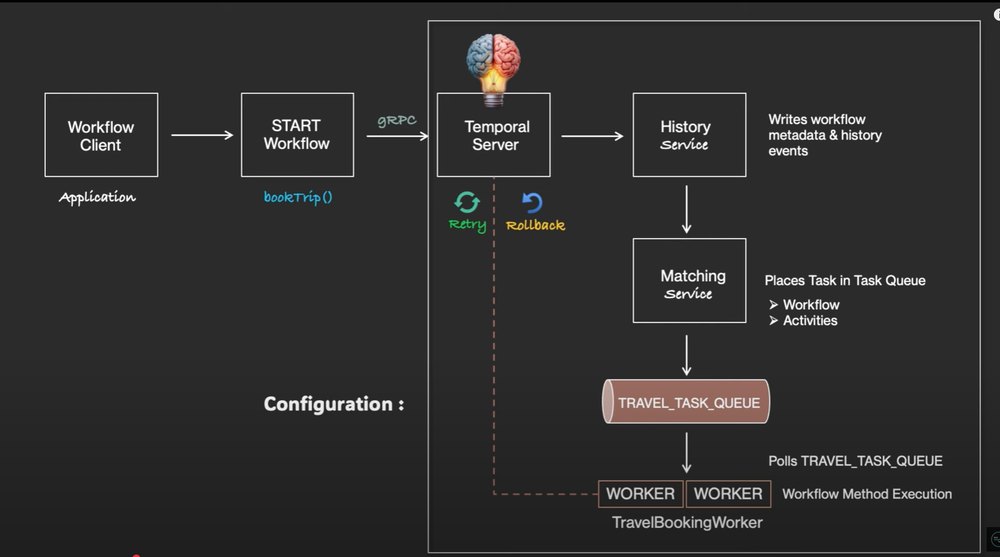

# Temporal Orchestration

Temporal is used to make services resilient reliable and easy to manage. It is
a powerful workflow engine that takes care of all the tricky parts, like
retries, timeouts and failure recovery.

## Use Case: Trip Booking System

At high level you would probably have these basic features like 

 - book a flight
 - Reserve a hotel
 - Schedule a cab

To design this, you can create 3 different microservices and then build an orchestration trip microservice 
to coordinate between them 

But what happens if the hotel service is down? Now things get tricky. Technically we need to add retry logic 
even rollback the previous successful step like cancel the flight if hotel booking fail. All this logic need
to be inside our code and even in every microservices. This is definitely a not reliable solution. How do we handle
this kind of scenario? That's where temporal comes in. Temporal handle

 - Failure recovery
 - State management
 - Orchestration across services

With the following features:

 - Auto retries
 - Timeout handling
 - Long-running workflows
 - Failure Recovery
 - State Management

### Using Temporal

In temporal terms all of this:

  - book a flight
  - Reserve a hotel
  - Schedule a cab

Are called *activities* and who trigger the activities is the *workflow* (The trip orchestration in our previous example)

 1. So our spring boot application will be the *Workflow client* 
 2. it connect to the Temporal Server which is the brain of the workflows. 
 3. The Temporal server contact the history service which writes workflow metadata and history events
 4. The Matching events create the task queue with workflow and activities
 5. Then the worker are the ones responsible to execute the tasks and then send back the response to the temporal server
 6. If something goes wrong temporal will Retry and Rollback automatically

### Useful commands for postgres

- Connection: `psql -h localhost -p 45001 -U temporal`
- List of databases: `\list`
- Connect to a database: `\connect temporal`
- List of schemas inside the database: `\dn+`

*Remember that in PostgresSQL, schemas are namespaces within a database that contain objects such as tables, views, functions, etc. Setting the search path determines in which order PostgreSQL will look for objects when they are referenced without a qualified schema name.*

In PostgresSQL, you don't "connect" directly to a schema as you do with a database. Instead, you set the current search path. Here's how to do it: 
- Setting the default search path: `SET search_path TO schema_name;`  `SHOW search_path;`
- To see tables in a specific schema: `\dt schema_name.*`
- To see view in a specific schema: `\dv schema_name.*`
- To see function in a specific schema: `\df schema_name.*`

In fact, you can join tables between different schemas:

    SELECT * FROM schema1.table1
    JOIN schema2.table2 ON schema1.table1.id = schema2.table2.id;